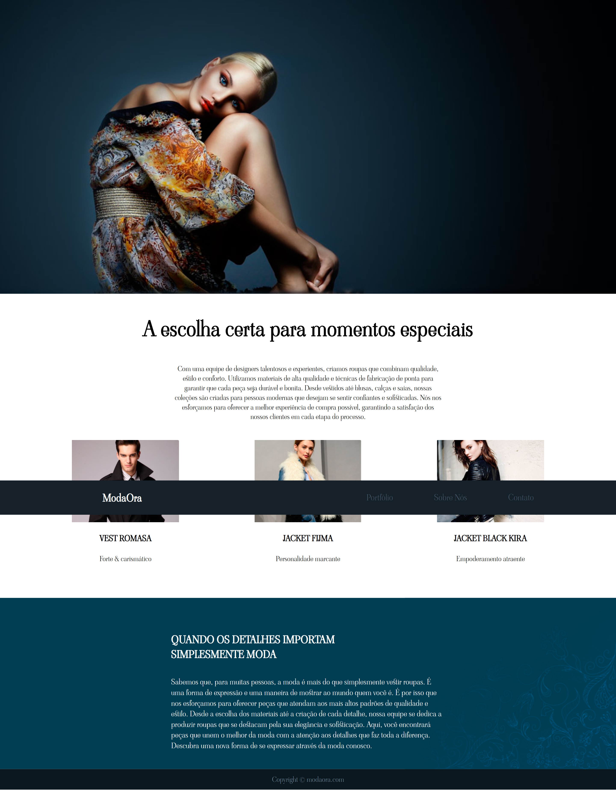

# 📌 Projeto de Conclusão - Sessão de Layout (Curso Frontend SerLiv)

## 📝 Descrição

Este projeto foi desenvolvido como parte da sessão de layout do curso de Frontend da SerLiv. O objetivo era replicar uma página utilizando **HTML**, **CSS** e **Flexbox**, garantindo um design responsivo e fiel ao modelo proposto.

---

## 🖼️ Screenshot do Projeto



---

## 🚀 Tecnologias Utilizadas

- HTML5
- CSS3
- Flexbox

---

## 📂 Estrutura do Projeto

```
📦 projeto-layout
├── 📁 assets
│   ├── 📄 estilos.css
│   ├── 📄 reset.css
│   ├── 🖼️ imagem.png
├── 📄 index.html
└── 📄 README.md
```

---

## 📌 Funcionalidades

✅ Estrutura de layout replicada fielmente ao modelo.
✅ Estilização responsiva utilizando **Flexbox**.
✅ Boas práticas de semântica HTML e organização do CSS.

---

## 🛠️ Aprendizados

Durante o desenvolvimento deste projeto, foram reforçados os seguintes conceitos:

- Uso de **Flexbox** para alinhamento e distribuição de espaços.
- Estruturação de **HTML semântico**.
- Melhores práticas na organização do CSS.

---

## 📬 Contato

🔗 [Seu LinkedIn](https://www.linkedin.com/in/felipe-muraoka-cardena-silva-a4698b13a/)  
📧 Email: felipemuraoka2016@outlook.com

---

Feito com 💙 para o curso **Frontend SerLiv** 🚀
